# Цель работы

Целью работы является освоение процедуры оформления отчетов с помощью легковесного языка разметки Markdown.

# Задание

1. Установка необходимого ПО  
2. Заполнение отчета по выполнению лабораторной работы №3 с помощью языка разметки Markdown  
3. Задание для самостоятельной работы  

# Теоретическое введение

Markdown - легковесный язык разметки, созданный с целью обозначения форматирования в простом тексте, с максимальным сохранением его читаемости человеком, и пригодный для машинного преобразования в языки для продвинутых публикаций. Внутритекстовые формулы делаются аналогично формулам LaTeX. В Markdown вставить изображение в документ можно с помощью непосредственного указания адреса изображения. Синтаксис Markdown для встроенной ссылки состоит из части [link text], представляющей текст гиперссылки, и части (file-name.md) – URL-адреса или имени файла, на который дается ссылка. Markdown поддерживает как встраивание фрагментов кода в предложение, так и их размещение между предложениями в виде отдельных огражденных блоков. Огражденные блоки кода – это простой способ выделить синтаксис для фрагментов кода.

# Выполнение лабораторной работы

## 4.1 Установка необходимого ПО для работы

Устанавливаю на свою виртуальную машину TexLive и Pandoc с помощью команд sudo dnf -y install texlive texlive-* и sudo dnf -y install pandoc.

## 4.2 Заполнение отчета по выполнению лабораторной работы №3 с помощью языка разметки Markdown

Открываю терминал. Перехожу в каталог курса, сформированный при выполнении прошлой лаборатной работы (рис. 4.1).
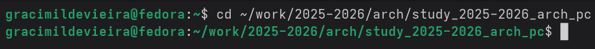

Рис. 4.1: Открытый терминал

Обновляю локальный репозиторий, скачав изменения из удаленного репозитория с помощью команды git pull (рис. 4.2).

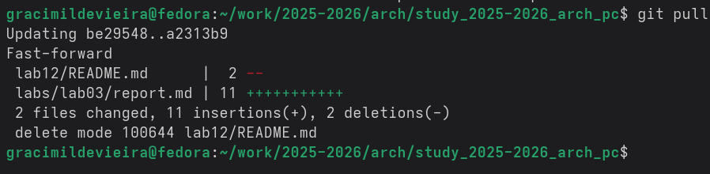
Рис. 4.2: Обновление удаленного репозитория

Перехожу в каталог с шаблоном отчета по лабораторной работе №3 с помощью cd (рис. 4.3).
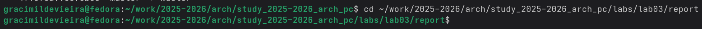

Рис. 4.3: Каталог с шаблоном отчета

Компилирую шаблон с использованием Makefile, вводя команду make (рис. 4.4).

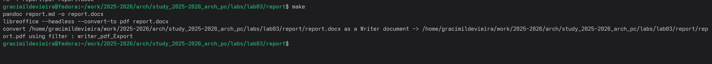

Рис. 4.4: Использование команды make

Открываю сгенерированный файл report.docx LibreOffice и сгенерированный файл report.pdf (рис. 4.5).

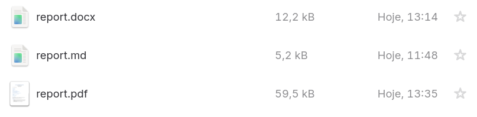

Рис. 4.5: Сгенерированные файлы

Убедилась, что все правильно сгенерировалось (рис. 4.6).

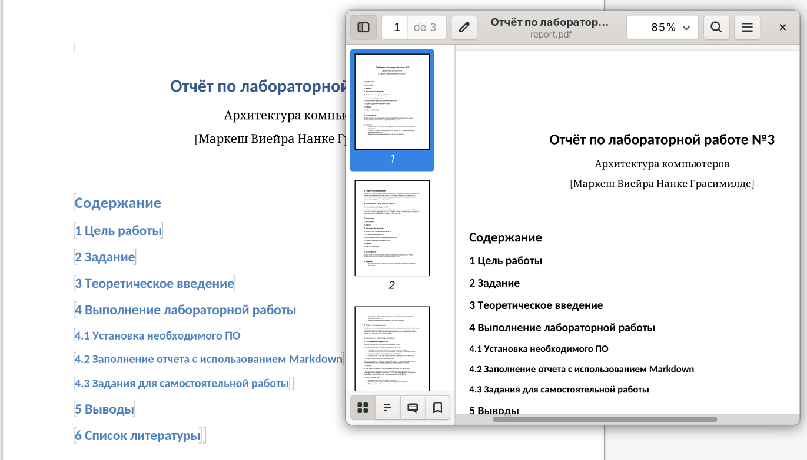

Рис. 4.6: Файлы сгенерированы верно

Удаляю полученные файлы с использованием Makefile, вводя команду make clean (рис. 4.7).

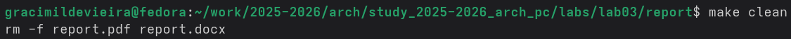

Рис. 4.7: Удаление файлов

Проверяю, удалились ли созданные файлы (рис. 4.8).

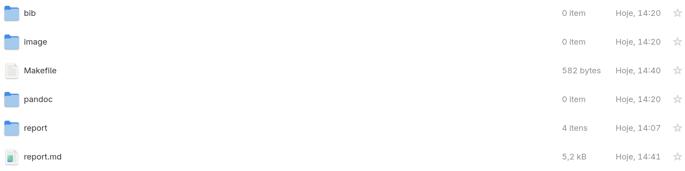

Рис. 4.8: Проверяем, удалились ли файлы

Открываю файл report.md с помощью текстового редактора gedit (рис. 4.9).

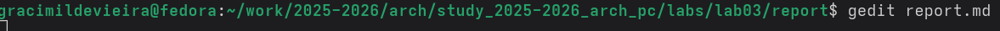
Рис. 4.9: Открытие файла в gedit

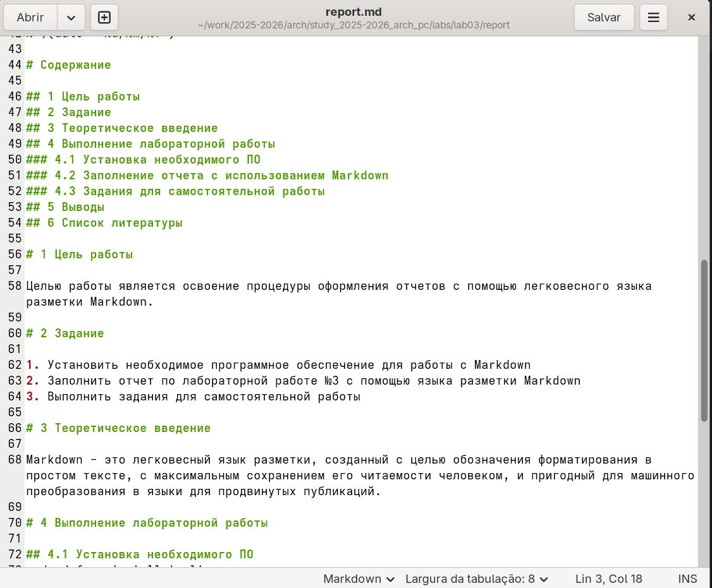

Рис. 4.10: Вид файла в gedit

Заполняю свой отчет. Компилирую файл с отчетом. Загружаю отчет на GitHub.

## 4.3 Задания для самостоятельной работы

Перехожу в директорию lab02/report с помощью cd, чтобы там заполнять отчет по второй лабораторной работе (рис. 4.11).

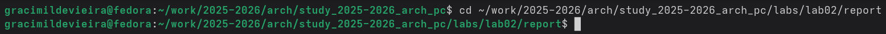
Рис. 4.11: Каталог 2 лабораторной работы

Копирую файл report.md с новым именем для заполнения отчета (рис. 4.12).

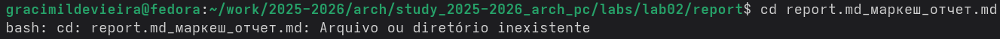

Рис. 4.12: Копирование файла

Открываю файл с помощью текстового редактора gedit и начинаю заполнять отчет (рис. 4.13).

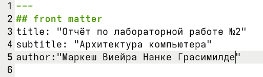

Рис. 4.13: Вид файла в gedit

Компилирую файл с отчетом по лабораторной работе (рис. 4.14).

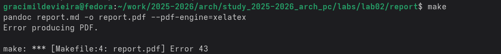

Рис. 4.14: Компиляция файла

Удаляю лишние сгенерированные файлы report.docx и report.pdf (рис. 4.15).

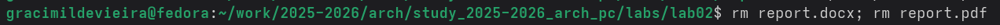

Рис. 4.15: Удаление лишних файлов

Добавляю изменения на GitHub с помощью комнадой git add и сохраняю изменения с помощью commit (рис. 4.16).

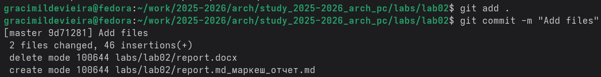

Рис. 4.16: Изменения на гитхаб и сохранение изменений

Отправлялю файлы на сервер с помощью команды git push (рис. 4.17).

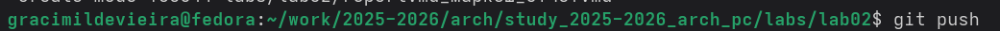
Рис. 4.17: Отправка файла на сервер

# Выводы

В результате выполнения данной лабораторной работы я освоила процедуры оформления отчетов с помощью легковесного языка разметки Markdown.

# Список литературы

1. Архитектура ЭВМ
