---
## Front matter
title: "Отчет по лабораторной работе №6"
subtitle: "Арифметические операции в NASM"
author: "Маркеш Виейра Нанке Грасимилде"

## Generic otions
lang: ru-RU
toc-title: "Содержание"

## Bibliography
bibliography: bib/cite.bib
csl: pandoc/csl/gost-r-7-0-5-2008-numeric.csl

## Pdf output format
toc: true # Table of contents
toc-depth: 2
lof: true # List of figures
fontsize: 12pt
linestretch: 1.5
papersize: a4
documentclass: scrreprt
## I18n polyglossia
polyglossia-lang:
  name: russian
  options:
	- spelling=modern
	- babelshorthands=true
polyglossia-otherlangs:
  name: english
## I18n babel
babel-lang: russian
babel-otherlangs: english
## Fonts
mainfont: IBM Plex Serif
romanfont: IBM Plex Serif
sansfont: IBM Plex Sans
monofont: IBM Plex Mono
mathfont: STIX Two Math
mainfontoptions: Ligatures=Common,Ligatures=TeX,Scale=0.94
romanfontoptions: Ligatures=Common,Ligatures=TeX,Scale=0.94
sansfontoptions: Ligatures=Common,Ligatures=TeX,Scale=MatchLowercase,Scale=0.94
monofontoptions: Scale=MatchLowercase,Scale=0.94,FakeStretch=0.9
mathfontoptions:
## Biblatex
biblatex: true
biblio-style: "gost-numeric"
biblatexoptions:
  - parentracker=true
  - backend=biber
  - hyperref=auto
  - language=auto
  - autolang=other*
  - citestyle=gost-numeric
## Pandoc-crossref LaTeX customization
figureTitle: "Рис."
tableTitle: "Таблица"
listingTitle: "Листинг"
lofTitle: "Список иллюстраций"
lolTitle: "Листинги"
## Misc options
indent: true
header-includes:
  - \usepackage{indentfirst}
  - \usepackage{float} # keep figures where there are in the text
  - \floatplacement{figure}{H} # keep figures where there are in the text
---

# 1 Цель работы

Освоение арифметических инструкций языка ассемблера NASM

# 2 Задание

1. Символьные и численные данные в NASM
2. Выполнение арифметических операций в NASM
3. Задание для самостоятельной работы


# 3 Теоретическое введение

Большинство инструкций на языке ассемблера требуют обработки операндов. Адрес операнда предоставляет место, где хранятся данные, подлежащие обработке. Это могут быть данные хранящиеся в регистре или в ячейке памяти. 

- Регистровая адресация – операнды хранятся в регистрах и в команде используются имена этих регистров, например: mov ax,bx.

- Непосредственная адресация – значение операнда задается непосредственно в команде, Например: mov ax,2.

- Адресация памяти – операнд задает адрес в памяти. В команде указывается символическое обозначение ячейки памяти, над содержимым которой требуется выполнить операцию.


Ввод информации с клавиатуры и вывод её на экран осуществляется в символьном виде. Кодирование этой информации производится согласно кодовой таблице символов ASCII. ASCII – сокращение от American Standard Code for Information Interchange (Американский стандартный код для обмена информацией). Согласно стандарту ASCII каждый символ кодируется одним байтом.
Среди инструкций NASM нет такой, которая выводит числа (не в символьном виде). Поэтому, например, чтобы вывести число, надо предварительно преобразовать его цифры в ASCII-коды этих цифр и выводить на экран эти коды, а не само число. Если же выводить число на экран непосредственно, то экран воспримет его не как число, а как последовательность ASCII-символов – каждый байт числа будет воспринят как один ASCII-символ – и выведет на экран эти символы.
Аналогичная ситуация происходит и при вводе данных с клавиатуры. Введенные данные будут представлять собой символы, что сделает невозможным получение корректного результата при выполнении над ними арифметических операций.
Для решения этой проблемы необходимо проводить преобразование ASCII символов в числа и обратно.


# 4 Выполнение лабораторной работы

## 4.1 Символьные и численные данные в NASM

С помощью утилиты mkdir создаю директорию, в которой буду создавать файлы с программами для лабораторной работы №6 (рис. 4.1). Перехожу в созданный каталог с помощью утилиты cd. С помощью утилиты touch создаю файл lab6-1.asm и с помощью утилиты ls проверяю, что файл действительно был создан (рис. 4.1).

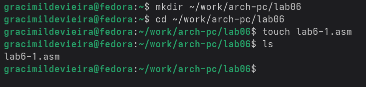

**Рис. 4.1: Создание директории**

Копирую в текущий каталог файл in_out.asm с помощью утилиты cp, т.к. он будет использоваться в других программах (рис. 4.2).


Открываю созданный файл lab6-1.asm, вставляю в него программу вывода значения регистра eax (рис. 4.3).

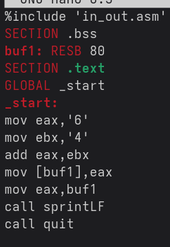

Создаю исполняемый файл программы и запускаю его (рис. 4.4). Вывод программы: символ j, потому что программа вывела символ, соответствующий по системе ASCII сумме двоичных кодов символов 4 и 6.

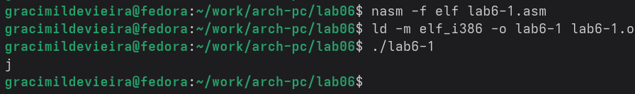

Изменяю в тексте программы символы "6" и "4" на цифры 6 и 4 (рис. 4.5). 

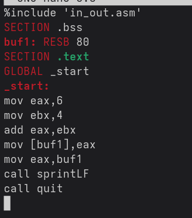

Создаю новый исполняемый файл программы и запускаю его (рис. 4.6). Теперь вывелся символ с кодом 10, это символ перевода строки, этот символ не отображается при выводе на экран.

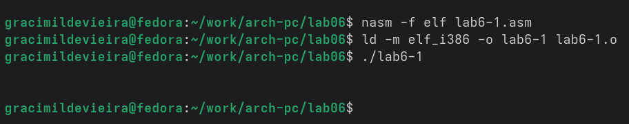

Создаю новый файл lab6-2.asm с помощью утилиты touch и проверяю с помощью ls, что файл был создан (рис. 4.7).

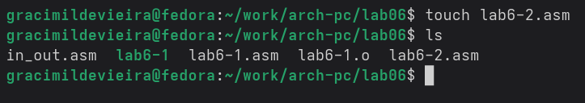

Ввожу в файл текст другой программы для вывода значения регистра eax (рис. 4.8).

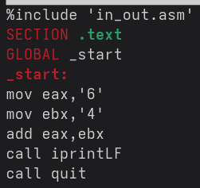

Создаю и запускаю исполняемый файл lab6-2 (рис. 4.9). Теперь вывод число 106, потому что программа позволяет вывести именно число, а не символ, хотя все еще происходит именно сложение кодов символов "6" и "4".

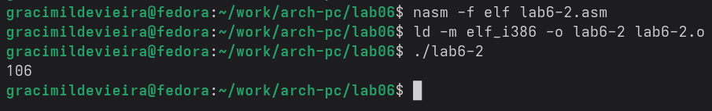

Заменяю в тексте программы в файле lab6-2.asm символы "6" и "4" на числа 6 и 4 (рис. 4.10).


Создаю и запускаю новый исполняемый файл (рис. 4.11).. Теперь программа складывает не соответствующие символам коды в системе ASCII, а сами числа, поэтому вывод 10.

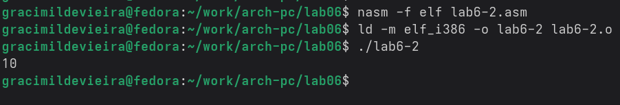

Заменяю в тексте программы функцию iprintLF на iprint (рис. 4.12).

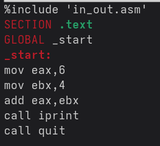

Создаю и запускаю новый исполняемый файл (рис. 4.13). Вывод не изменился, потому что символ переноса строки не отображался, когда программа исполнялась с функцией iprintLF, а iprint не добавляет к выводу символ переноса строки, в отличие от iprintLF.

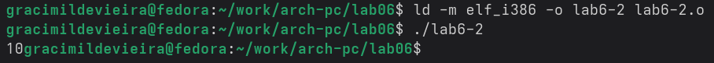

## 4.2 Выполнение арифметических операций в NASM

Создаю файл lab6-3.asm с помощью утилиты touch (рис. 4.14).

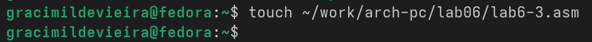

Ввожу в созданный файл текст программы для вычисления значения выражения f(x) = (5 * 2 + 3)/3 (рис. 4.15).

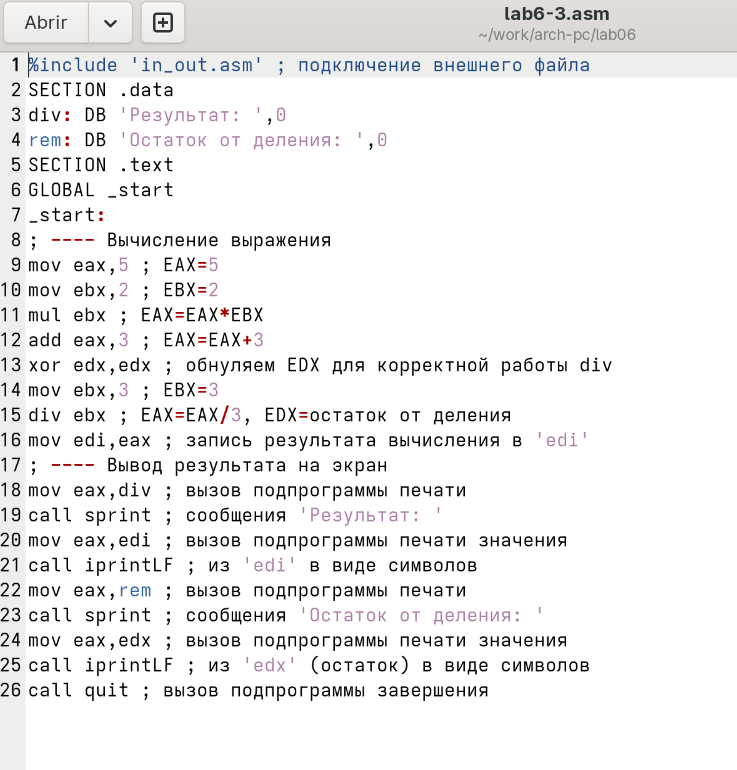

Создаю исполняемый файл и запускаю его (рис. 4.16).

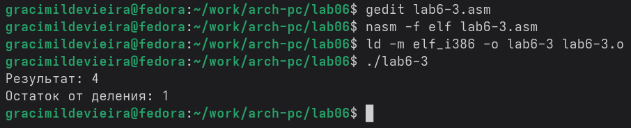

Изменяю программу так, чтобы она вычисляла значение выражения f(x) = (4 * 6 + 2)/5 (рис. 4.17). 

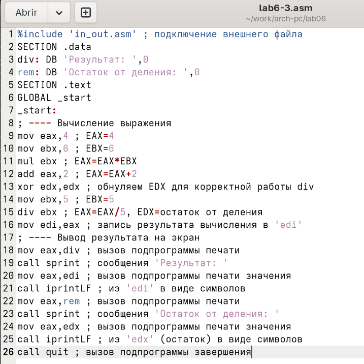

Создаю и запускаю новый исполняемый файл (рис. 4.18). Я посчитала для проверки правильности работы программы значение выражения самостоятельно, программа отработала верно.

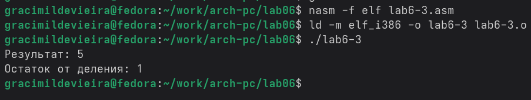

Создаю файл variant.asm с помощью  утилиты touch (рис. 4.19).

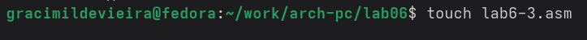

Ввожу в файл текст программы для вычисления варианта задания по номеру студенческого билета (рис. 4.20).

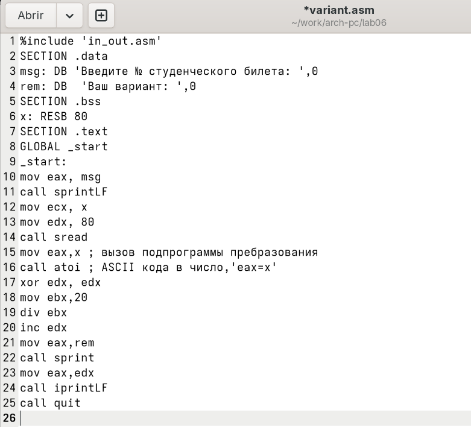

Создаю и запускаю исполняемый файл (рис. 4.21). Ввожу номер своего студ. билета с клавиатуры, программа вывела, что мой вариант - 17.

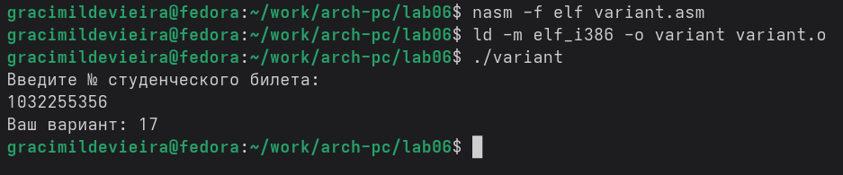


## 4.3 Вопросы по программе

1. За вывод сообщения "Ваш вариант" отвечают строки кода:

```NASM
mov eax,rem
call sprint
```
2. Инструкция 

```NASM
mov ecx, x
```
используется, чтобы положить адрес вводимой строки x в регистр ecx

```NASM
mov edx, 80
```
это запись в регистр edx длины вводимой строки 


```NASM
call sread
```
это вызов подпрограммы из внешнего файла, обеспечивающей ввод сообщения с клавиатуры 

3. call atoi используется для вызова подпрограммы из внешнего файла, которая преобразует ascii-код символа в целое число и записывает результат в регистр eax

4. За вычисления варианта отвечают строки:

```NASM
xor edx,edx ; обнуление edx для корректной работы div
mov ebx,20 ; ebx = 20
div ebx ; eax = eax/20, edx - остаток от деления
inc edx ; edx = edx + 1
```

5. При выполнении инструкции div ebx остаток от деления записывается в регистр edx

6. Инструкция inc edx увеличивает значение регистра edx на 1

7. За вывод на экран результатов вычислений отвечают строки:

```NASM
mov eax,edx
call iprintLF
```

## 4.4 Задание для самостоятельной работы

Создаю файл lab6-4.asm с помощью утилиты touch (рис. 4.22).

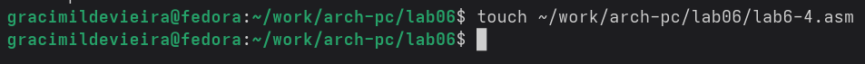

Открываю созданный файл для редактирования, ввожу в него текст программы для вычисления значения выражения 18(x + 1)/6 (рис. 4.23). Это выражение было под вариантом 17.


Создаю и запускаю исполняемый файл (рис. 4.24). При вводе значения 3, вывод - 108.

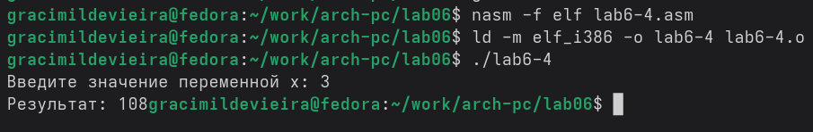

Провожу еще один запуск исполняемого файла для проверки работы программы с другим значением на входе - 1 (рис. 4.25). Программа отработала верно и в ответе мы получили 6.

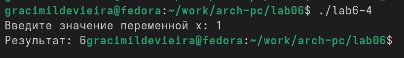

**Листинг 4.1. Программа для вычисления значения выражения 18(x + 1)/6.**

```NASM
%include 'in_out.asm' ; подключение внешнего файла
SECTION .data
msg: DB 'Введите значение переменной x:',0
rem: DB 'Результат: ',0
SECTION .bss
x: RESB 80; Переменная, значение которой будем вводить с клавиатуры
SECTION .text
GLOBAL _start
_start:
; ---- Вычисление выражения
mov eax,msg
call sprint
mov ecx, x 
mov edx, 80
call sread
mov eax,x ; вызов подпрограммы преобразрвания
call atoi ; ASCII кода в число, `eax=x`
add eax, 1; eax = eax 1 = x + 1
mov ebx,eax
imul eax,ebx; EAX = 18 * (x +1)
mov ebx,6
imul eax,ebx; EAX = 18(x+1)/6
mov edi,eax ; запись результата вычисления в 'edi'
; ---- Вывод результата на экран
mov eax,rem ; вызов подпрограммы печати
call sprint ; сообщения 'Результат: '
mov eax,edi ; вызов подпрограммы печати значения
call iprint ; из 'edi' в виде символов
call quit ; вызов подпрограммы завершения
```

# Выводы

При выполнении данной лабораторной работы я освоила арифметические инструкции языка ассемблера NASM.

# Список литературы

[Лабораторная работа 6](https://esystem.rudn.ru/pluginfile.php/2089086/mod_resource/content/0/%D0%9B%D0%B0%D0%B1%D0%BE%D1%80%D0%B0%D1%82%D0%BE%D1%80%D0%BD%D0%B0%D1%8F%20%D1%80%D0%B0%D0%B1%D0%BE%D1%82%D0%B0%20%E2%84%966.%20%D0%90%D1%80%D0%B8%D1%84%D0%BC%D0%B5%D1%82%D0%B8%D1%87%D0%B5%D1%81%D0%BA%D0%B8%D0%B5%20%D0%BE%D0%BF%D0%B5%D1%80%D0%B0%D1%86%D0%B8%D0%B8%20%D0%B2%20NASM..pdf)

