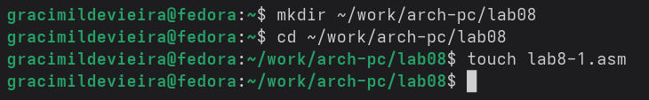
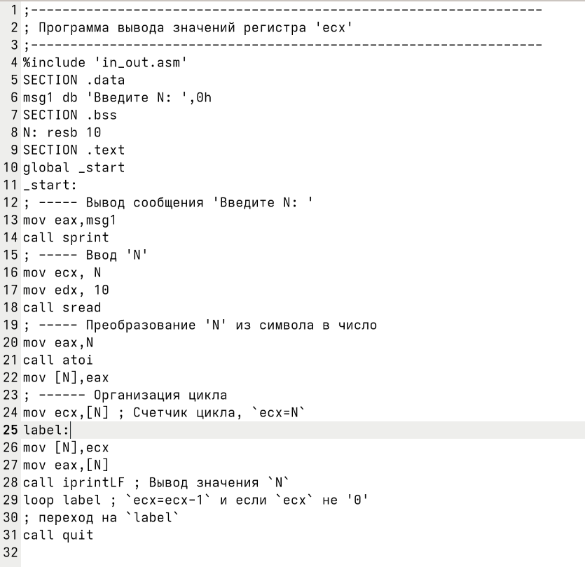
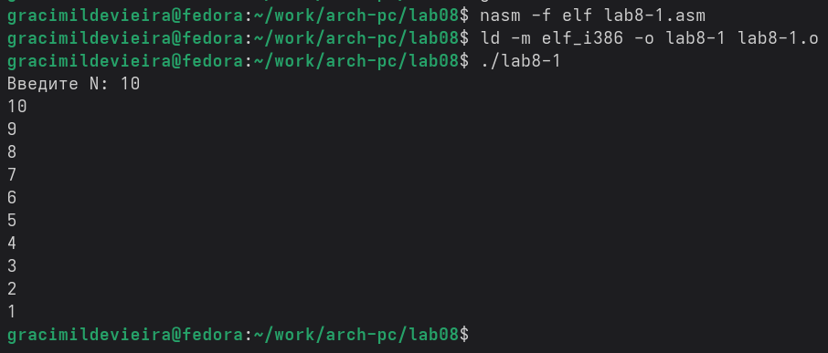
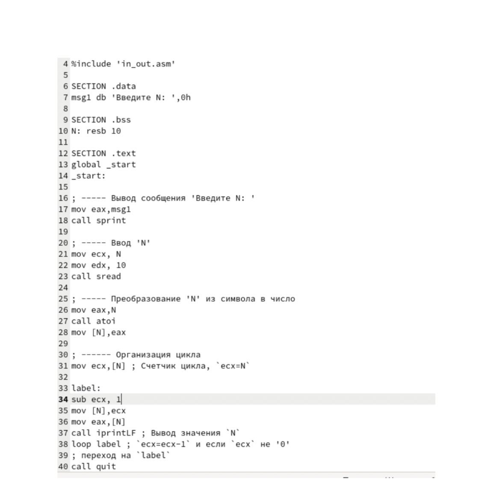

##  Отчет по лабораторной работе №8 ##
#  Программирование цикла. Обработка аргументов командной строки. #

                             Маркеш Виейра Нанке Грасимилде

# 1 Цель работы

Приобретение навыков написания программ с использованием циклов и обработкой аргументов командной строки.

# 2 Задание

1. Реализация циклом в NASM
2. Обработка аргументов командной строки
3. Задание для самостоятельной работы

# 3 Теоретическое введение

Стек — это структура данных, организованная по принципу LIFO («Last In — First Out» или «последним пришёл — первым ушёл»). Стек является частью архитектуры процессора и реализован на аппаратном уровне. Для работы со стеком в процессоре есть специальные регистры (ss, bp, sp) и команды.
Основной функцией стека является функция сохранения адресов возврата и передачи аргументов при вызове процедур. Кроме того, в нём выделяется память для локальных переменных и могут временно храниться значения регистров.

# 4 Выполнение лабораторной работы

## 4.1 Реализация циклов в NASM

Создаю каталог для программ лабораторной работы №8 и файл lab8-1.asm, куда буду копировать программу из листинга. (рис. -fig.4.1).



Копирую в созданный файл программу из листинга. (рис. -fig.4.2).



Запускаю программу, она показывает работу циклов в NASM (рис. -fig.4.3).



Изменяю изначальную программу так, что в теле цикла я изменяю значение регистра ecx (рис. -fig.4.4).



Из-за того, что теперь регистр ecx на каждой итерации уменьшается на 2 значения, количество итераций уменьшается вдвое ((рис. -fig.4.5).


Добавляю команды push и pop в программу (рис. -fig.4.6).


Теперь количество итераций совпадает введенному N, но произошло смещение выводимых чисел на -1 ((рис. -fig.4.7).


## 4.2 Обработка аргументов командной строки

Создаю новый файл для программы и копирую в него код из следующего листинга (рис. -fig.4.8).


Компилирую программу и запускаю, указав аргументы. Программой было обратоно то же количество аргументов, что и было введено (рис. -fig.4.9).


Создаю новый файл для программы и копирую в него код из третьего листинга (рис. -fig.4.10).


Компилирую программу и запускаю, указав в качестве аргументов некоторые числа, программа их складывает (рис. -fig.4.11).


Изменяю поведение программы так, чтобы указанные аргументы она умножала, а не складывала (рис. -fig.4.12).


Программа действительно теперь умножает данные на вход числа (рис. -fig.4.13).


## 4.3 Задание для самостоятельной работы

Пишу программму, которая будет находить сумма значений для функции f(x) = 10(x - 1), которая совпадает с моим вариантом - 17. 


Код программы:
```NASM

     %include 'in_out.asm'

SECTION .data
msg_func db 'Функция: f(x) = 10(x - 1)', 0h
msg_res  db 'Результат: ', 0h

SECTION .text
global _start

_start:
    ; Показываем функцию
    mov eax, msg_func
    call sprintLF

    pop ecx          ; Извлекаем количество аргументов
    pop eax          ; Извлекаем имя программы
    sub ecx, 1       ; Убираем имя программы из количества
    
    mov ebx, 0       ; Сумма начинается с 0

process_loop:
    pop eax          ; Извлекаем x_i
    call atoi        ; Преобразуем в число
    
    ; === f(x) = 10(x - 1) ===
    sub eax, 1       ; x - 1
    mov edx, eax     ; Сохраняем (x-1) в EDX
    add eax, eax     ; 2(x-1)
    add eax, eax     ; 4(x-1) 
    add eax, eax     ; 8(x-1)
    add eax, edx     ; 8(x-1) + (x-1) = 9(x-1)
    add eax, edx     ; 9(x-1) + (x-1) = 10(x-1)
    
    add ebx, eax     ; Добавляем f(x) к общей сумме
    loop process_loop

    ; Показываем результат
    mov eax, msg_res
    call sprint
    mov eax, ebx
    call iprintLF
    
    call quit
```

Проверяю работу программы, указав в качестве аргумента несколько чисел (рис. -fig.4.14).


# 5 Выводы

В результате выполнения данной лабораторной работы я приобрела навыки написания программ с использованием циклов, а также научилась обрабатывать аргументы командной строки.

# 6 Список литературы

1. [Курс на ТУИС](https://esystem.rudn.ru/course/view.php?id=112)
2. [Лабораторная работа №8](https://esystem.rudn.ru/pluginfile.php/2089095/mod_resource/content/0/%D0%9B%D0%B0%D0%B1%D0%BE%D1%80%D0%B0%D1%82%D0%BE%D1%80%D0%BD%D0%B0%D1%8F%20%D1%80%D0%B0%D0%B1%D0%BE%D1%82%D0%B0%20%E2%84%968.%20%D0%9F%D1%80%D0%BE%D0%B3%D1%80%D0%B0%D0%BC%D0%BC%D0%B8%D1%80%D0%BE%D0%B2%D0%B0%D0%BD%D0%B8%D0%B5%20%D1%86%D0%B8%D0%BA%D0%BB%D0%B0.%20%D0%9E%D0%B1%D1%80%D0%B0%D0%B1%D0%BE%D1%82%D0%BA%D0%B0%20%D0%B0%D1%80%D0%B3%D1%83%D0%BC%D0%B5%D0%BD%D1%82%D0%BE%D0%B2%20%D0%BA%D0%BE%D0%BC%D0%B0%D0%BD%D0%B4%D0%BD%D0%BE%D0%B9%20%D1%81%D1%82%D1%80%D0%BE%D0%BA%D0%B8.pdf)

